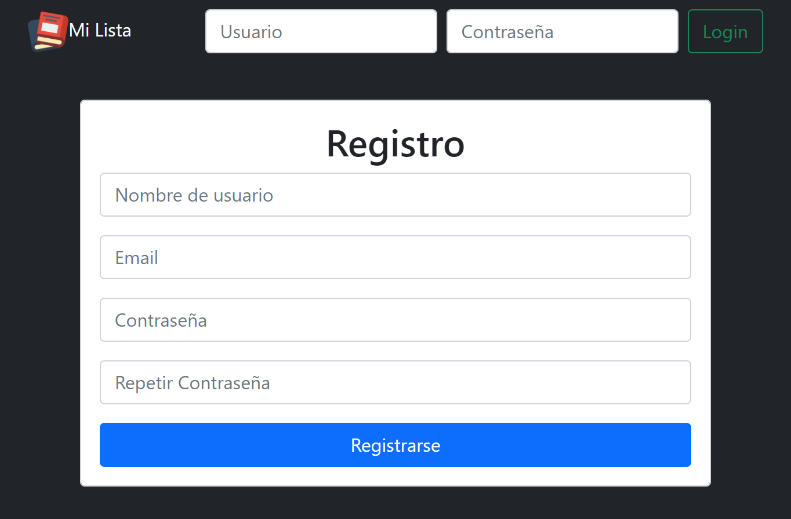

# Formulario-Registro
Formulario de registro de un nuevo usuario a una base de datos con doble validacion de datos (primero con JS y despues con PHP), verificacion de email y encriptacion de contraseña y.

