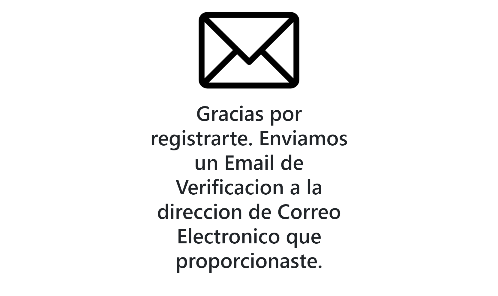

# Formulario-Registro
Formulario de registro de un nuevo usuario a una base de datos con doble validacion de datos (primero con JS y despues con PHP), verificacion de email y encriptacion de contraseña

DEMO: 

1. El formulario valida los datos:

2. Si los datos son correctos nos muestra que ya mando el correo:

3. Si verificamos nuestro email podemos ver que efectivamente si nos mando el email: 

4. Al dar clic en el link que viene en el email nos activa nuestra cuenta en la base de datos y nos muestra esta ventana que nos dice que ya esta activada la cuenta: 

